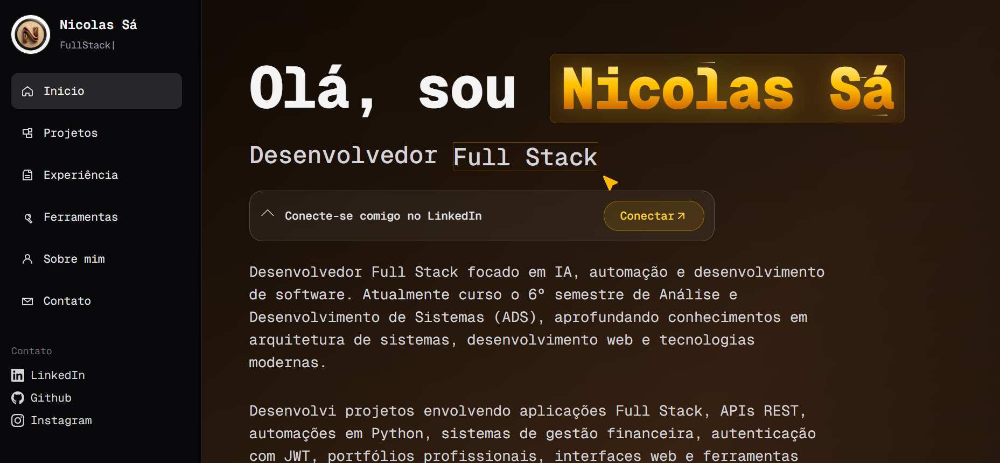

# Nicolas Sá — Portfólio



Portfólio pessoal desenvolvido para apresentar meus projetos, experiências, habilidades e tecnologias utilizadas no desenvolvimento de software.

Portfólio pessoal desenvolvido para apresentar meus projetos, experiências, habilidades e tecnologias utilizadas no desenvolvimento de software.

🚀 **Acesse o portfólio:** https://nsawork.vercel.app/

---

## Sobre o projeto

Este projeto foi desenvolvido como meu portfólio profissional, reunindo projetos acadêmicos e pessoais nas áreas de desenvolvimento Full Stack, automação, inteligência artificial, dados e desenvolvimento web.

O objetivo é apresentar de forma organizada minha experiência prática, tecnologias que utilizo e projetos que desenvolvi ao longo da minha formação.

---

## Tecnologias

* **Next.js**
* **React**
* **TypeScript**
* **Tailwind CSS**
* **JavaScript**
* **HTML & CSS**
* **Git & GitHub**
* **Vercel**

Além dessas tecnologias, o portfólio apresenta projetos desenvolvidos utilizando diferentes ferramentas e tecnologias, como:

* Python
* Java
* Spring Boot
* Node.js
* Express
* MongoDB
* PostgreSQL
* Supabase
* Power BI
* OpenAI API
* Selenium
* PyAutoGUI

---

## Funcionalidades

* Apresentação profissional
* Página de experiências
* Portfólio de projetos
* Páginas individuais para cada projeto
* Tecnologias e ferramentas utilizadas
* Links para repositórios e projetos
* Seção de contato
* Interface responsiva
* Animações e componentes interativos
* Navegação entre diferentes seções do portfólio

---

## Estrutura do projeto

```text
app/
├── about/
├── contact/
├── experience/
├── projects/
├── tools/
├── components/
├── favicon.ico
├── globals.css
├── layout.tsx
└── page.tsx

lib/
├── projects-data.ts
└── utils.ts

public/
├── images
├── videos
└── certificates
```


## Deploy

O projeto está hospedado na **Vercel** e conectado ao repositório do GitHub.

Cada novo `push` para a branch `main` gera automaticamente um novo deploy.

---

## Autor

**Nicolas Sá**

Full Stack Developer | Python • IA • Dados • Automação

GitHub: [@nsawork](https://github.com/nsawork)

---

## Licença

Este projeto é um portfólio pessoal. O código pode ser consultado para fins de estudo e referência, mas os conteúdos, imagens, vídeos e materiais apresentados não devem ser reutilizados sem autorização.
